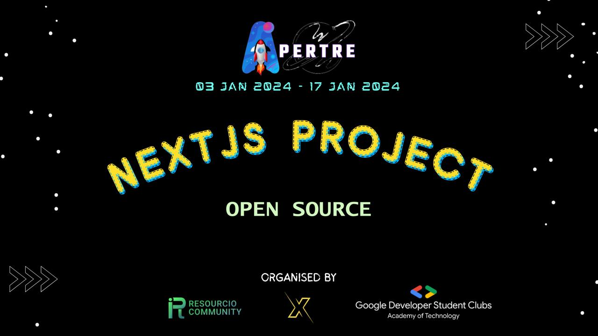

<h1 align="center">Apertre NextJS Project</h1>

 <div align="center">
 <p>

[](https://github.com/ellerbrock/open-source-badges/)


 </p>
 </div>

This Next.js project is dedicated to creating a Web Chat App based on a Figma design file. The Web Chat App design is available in a Figma community file, which you can access [here](https://www.figma.com/file/BcNhPtrX9pwbCFUWVNL8Zn/Chatting-app-with-summarizer-(Community)?type=design&node-id=0%3A1&mode=design&t=wAzxO7mh1glHjPCh-1).

`*** Note: Since this is a community project, your contributions will go toward an open-source software project rather than someone else's project, allowing you to use pull requests and issues to learn more and contribute more.***`

## Project Overview

The Apertre NextJS Project is all about bringing a Figma design to life by developing a functional and responsive Web Chat App. Here are the key features and goals of this project:

- **Web Chat App Design**: The project is centered around the design provided in the Figma file, ensuring that the final product closely resembles the provided design.

- **Next.js**: This project is built using Next.js, a popular React framework, which provides server-side rendering and other performance benefits. It is a great choice for creating web applications.

- **Responsive Design**: The Web Chat App will be designed to work seamlessly on various devices and screen sizes, ensuring a great user experience for all users.

- **Data Integration**: Depending on the project requirements, you might need to integrate real data or mock data to populate the Web Chat App with information.

- **Modular Components**: The project will be structured into reusable components, making it easier to maintain and extend in the future.

## Getting Started

To get started with the Apertre NextJS Project, follow these steps:

1. Clone this repository to your local machine:

   ```bash
   git clone https://github.com/your-username/apertre_nextjsprojectt.git
   ```

2. Navigate to the project folder:

   ```bash
   cd apertre_nextjsprojectt
   ```

3. Install the project dependencies:

   ```bash
   npm install
   ```

4. Run the development server:

   ```bash
   npm run dev
   ```

5. Open your web browser and visit [http://localhost:3000](http://localhost:3000) to see the project in action.

## Project Structure

The project is structured in a way that promotes maintainability and scalability. Here's a high-level overview of the project structure:

```
apertre_nextjsprojectt/
│   .eslintrc.json
│   .gitattributes
│   .gitignore
│   .gitmodules
│   CHANGELOG.md
│   CODE_OF_CONDUCT.md
│   CONTRIBUTING.md
│   CREDITS.md
│   LICENSE
│   next-env.d.ts
│   next.config.js
│   package-lock.json
│   package.json
│   postcss.config.js
│   README.md
│   ROADMAP.md
│   SECURITY.md
│   tailwind.config.ts
│   tsconfig.json
│
├───.github
│       ISSUES.md
│       LABELS.md
│       PULL_REQUESTS.md
│
├───assets
│       logo.jpeg
│       logo.jpg
│
├───design
│       Page1.png
│       page2.png
│
├───docs
│       GETTING_STARTED.md
│       ISSUE_TEMPLATE.md
│       PULL_REQUEST_TEMPLATE.md
│
├───public
│       next.svg
│       vercel.svg
│
└───src
    └───app
            favicon.ico
            globals.css
            layout.tsx
            page.tsx
```

## Contributing

We welcome contributions to make this project even better. If you'd like to contribute, please follow these steps:

1. Fork the repository on GitHub.
2. Create a new branch with a descriptive name.
3. Make your changes and commit them.
4. Push your branch to your fork.
5. Submit a pull request to the main repository.

## License

This project is open-source and available under the MIT License. You can find more details in the [LICENSE](LICENSE) file.

## Acknowledgments

We want to express our gratitude to the Figma community for providing the beautiful design that inspired this project.

Happy coding!

If you have any questions or need further assistance, feel free to reach out to us.
